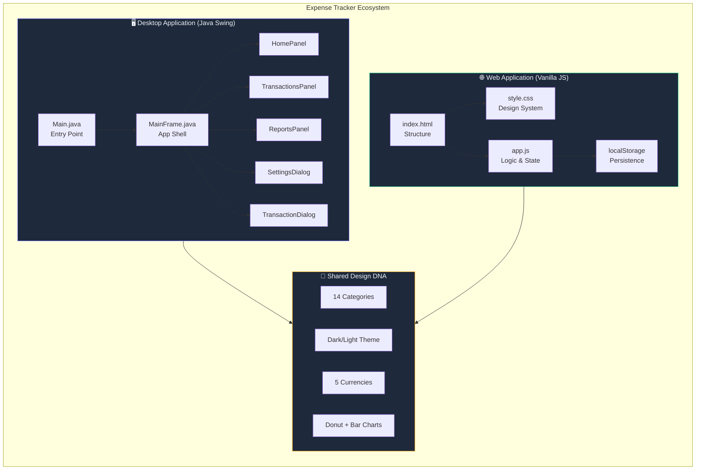
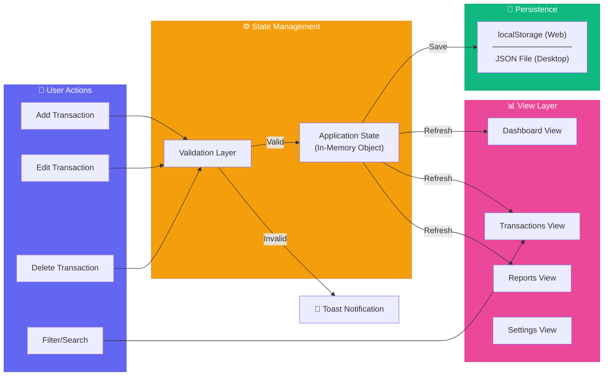
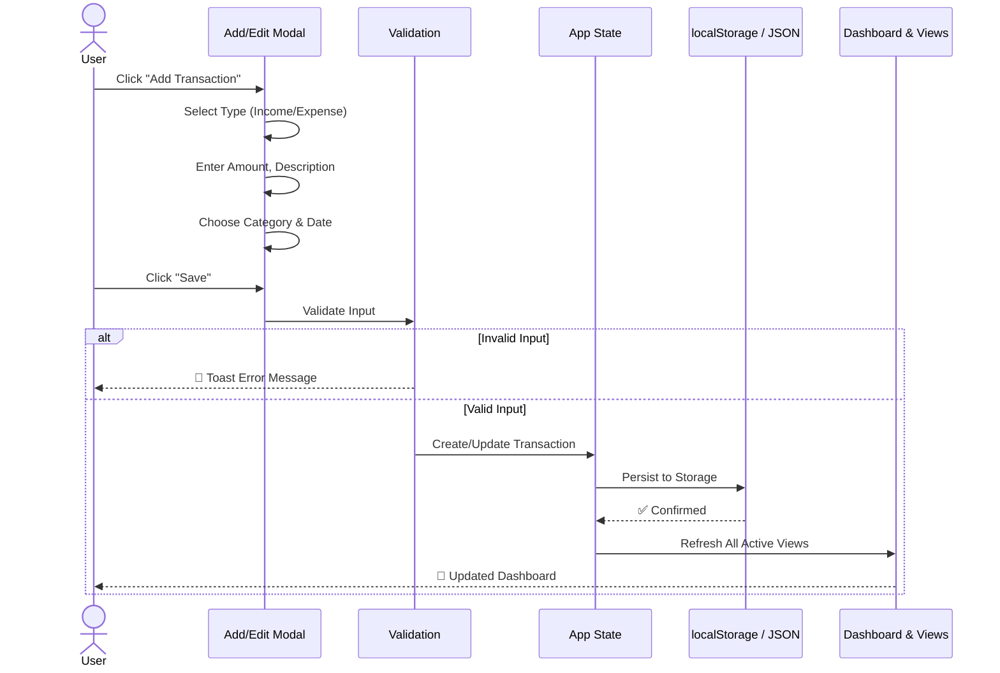
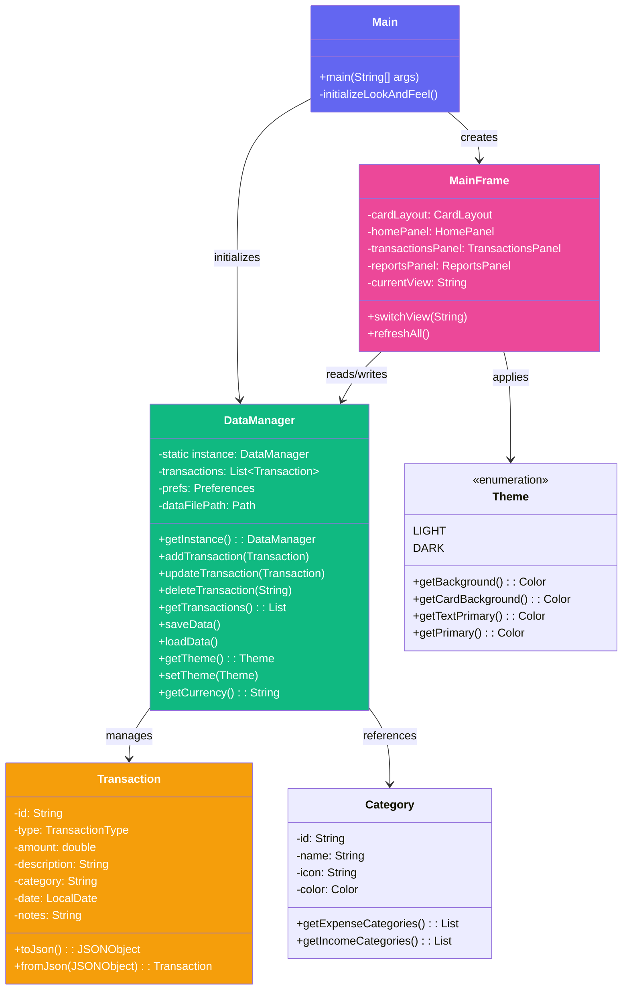
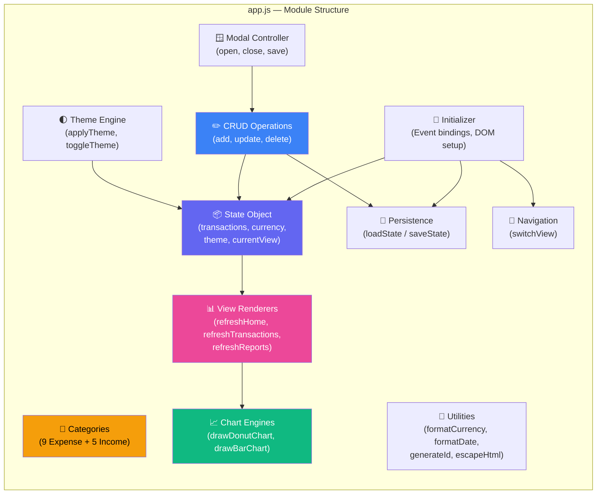
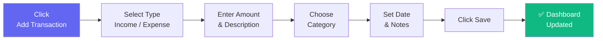
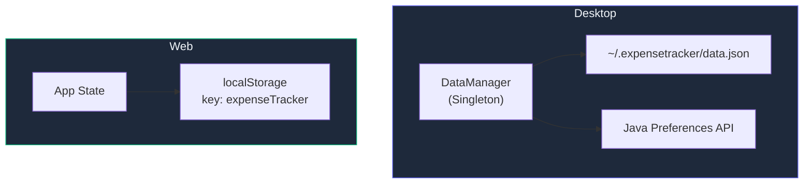

<div align="center">

# 💰 Expense Tracker

### Smart Financial Management — Reimagined

[](https://openjdk.org/)
[](https://developer.mozilla.org/)
[](https://vercel.com/)
[](LICENSE)

A beautifully crafted, full-featured expense tracking application with **dual deployment** — a Java Swing desktop application **AND** a modern web dashboard deployable on Vercel. Track income, expenses, analyze spending habits with visual reports, and take full control of your finances.

[🚀 Live Demo](#deployment) · [📖 Documentation](#architecture) · [🐛 Report Bug](../../issues) · [✨ Request Feature](../../issues)

---

</div>

## ✨ Features at a Glance

| Feature | Desktop (Java) | Web (Vercel) |
|---|:---:|:---:|
| 📊 Interactive Dashboard | ✅ | ✅ |
| 💸 Income & Expense Tracking | ✅ | ✅ |
| 🏷️ 14 Color-coded Categories | ✅ | ✅ |
| 🔍 Search & Filter Transactions | ✅ | ✅ |
| 📈 Visual Reports (Donut + Bar Charts) | ✅ | ✅ |
| 🌓 Dark / Light Theme | ✅ | ✅ |
| 💱 Multi-Currency (5 currencies) | ✅ | ✅ |
| 📤 Data Export (JSON) | ✅ | ✅ |
| 🔐 Local Data Persistence | JSON File | localStorage |
| ☁️ Cloud Deployment | ❌ | ✅ |
| 📱 Responsive Layout | ❌ | ✅ |

---

## 🎯 Why This Project?

> Traditional finance apps are either bloated with features no one uses, or too simple to be useful. **Expense Tracker** hits the sweet spot — a clean, zero-config, privacy-first tool that works instantly.

- **🔒 Privacy First** — All data stays locally. No servers, no accounts, no tracking.
- **⚡ Zero Setup** — Open and start tracking. No registration, no database setup.
- **🎨 Beautiful UI** — Designed with modern aesthetics — gradients, animations, and glassmorphism.
- **🔄 Dual Platform** — Same features on Desktop (Java) and Web (Vercel).

---

## 🏗️ Architecture

The project contains two independent implementations sharing the same design language and feature set:



---

## 📐 System Design

### Data Flow Architecture



### Transaction Lifecycle



---

## 📁 Project Structure

```
java-expense-tracker/
│
├── 🌐 WEB APPLICATION (Vercel-Ready)
│   ├── index.html              ← Main HTML structure (sidebar + views)
│   ├── style.css               ← Full design system (~1400 lines)
│   ├── app.js                  ← Application logic & state management
│   ├── vercel.json             ← Vercel deployment configuration
│   └── .vercelignore           ← Files excluded from deployment
│
├── 🖥️ DESKTOP APPLICATION (Java Swing)
│   ├── src/com/expensetracker/
│   │   ├── main/
│   │   │   └── Main.java               ← Entry point & LaF initialization
│   │   ├── model/
│   │   │   ├── Transaction.java         ← Transaction data model (POJO)
│   │   │   └── Category.java           ← Category definitions & colors
│   │   ├── data/
│   │   │   ├── DataManager.java         ← Singleton data persistence layer
│   │   │   └── JsonUtil.java            ← JSON serialization utilities
│   │   ├── ui/
│   │   │   ├── MainFrame.java           ← App shell, nav, CardLayout
│   │   │   ├── HomePanel.java           ← Dashboard with balance cards
│   │   │   ├── TransactionsPanel.java   ← Full transaction list + filters
│   │   │   ├── ReportsPanel.java        ← Charts & analytics
│   │   │   ├── TransactionDialog.java   ← Add/Edit modal form
│   │   │   └── SettingsDialog.java      ← Theme, currency, export
│   │   └── util/
│   │       ├── Theme.java               ← Color palette & font system
│   │       └── UIUtil.java              ← Painting + rendering helpers
│   ├── pom.xml                          ← Maven build configuration
│   └── run.bat                          ← Windows build script
│
├── lib/                        ← External JAR dependencies
├── out/                        ← Compiled .class files
├── target/                     ← Maven build output
└── README.md                   ← You are here! 📍
```

---

## 🧩 Component Architecture

### Desktop (Java Swing)



### Web (JavaScript)



---

## 🎨 Design System

### Color Palette

| Token | Light Mode | Dark Mode | Usage |
|---|---|---|---|
| `--primary` | `#6366f1` | `#6366f1` | Buttons, active states, brand |
| `--success` | `#10b981` | `#10b981` | Income, positive values |
| `--danger` | `#ef4444` | `#ef4444` | Expenses, delete actions |
| `--warning` | `#f59e0b` | `#f59e0b` | Alerts, food category |
| `--bg-primary` | `#f1f5f9` | `#0f172a` | Page background |
| `--bg-secondary` | `#ffffff` | `#1e293b` | Cards, panels |
| `--bg-sidebar` | `#1e293b` | `#0b1120` | Sidebar navigation |
| `--text-primary` | `#1e293b` | `#f1f5f9` | Headings, primary text |
| `--text-secondary` | `#64748b` | `#94a3b8` | Labels, descriptions |

### Category Colors

| Category | Color | Icon |
|---|---|---|
| 🍕 Food | `#f59e0b` | `fa-utensils` |
| 🚗 Transport | `#3b82f6` | `fa-car` |
| 🛍️ Shopping | `#ec4899` | `fa-bag-shopping` |
| 🎬 Entertainment | `#8b5cf6` | `fa-film` |
| 📄 Bills | `#ef4444` | `fa-file-invoice-dollar` |
| 💚 Health | `#10b981` | `fa-heart-pulse` |
| 🎓 Education | `#06b6d4` | `fa-graduation-cap` |
| 👤 Personal | `#6366f1` | `fa-user` |
| ⋯ Other | `#64748b` | `fa-ellipsis` |
| 💼 Salary | `#10b981` | `fa-briefcase` |
| 💻 Freelance | `#06b6d4` | `fa-laptop-code` |
| 📈 Investment | `#8b5cf6` | `fa-chart-line` |
| 🎁 Gift | `#ec4899` | `fa-gift` |

### Typography

```
Font Family: 'Inter' (Google Fonts)
─────────────────────────────────────
Weight 300 ─ Light    → Subtle descriptions
Weight 400 ─ Regular  → Body text
Weight 500 ─ Medium   → Labels
Weight 600 ─ Semibold → Buttons, navigation
Weight 700 ─ Bold     → Headings, amounts
Weight 800 ─ Extrabold → Balance display, emphasis
```

---

## 🚀 Getting Started

### Prerequisites

| Tool | Desktop | Web |
|---|---|---|
| Java 17+ | ✅ Required | ❌ Not needed |
| Maven 3.6+ | ✅ Recommended | ❌ Not needed |
| Node.js | ❌ Not needed | ✅ For Vercel CLI |
| Modern Browser | ❌ Not needed | ✅ Required |

### 🖥️ Desktop Application

#### Option 1: Maven (Recommended)

```bash
# Clone the repository
git clone https://github.com/yourusername/expense-tracker.git
cd "java expence tracker"

# Build and run
mvn clean compile
mvn exec:java -Dexec.mainClass="com.expensetracker.main.Main"

# Or package as JAR
mvn package
java -jar target/expense-tracker-1.0.0.jar
```

#### Option 2: Manual Compilation

```bash
mkdir -p out

# Compile (Windows)
javac -d out -cp "lib/*" src/com/expensetracker/main/Main.java ^
    src/com/expensetracker/model/*.java ^
    src/com/expensetracker/data/*.java ^
    src/com/expensetracker/ui/*.java ^
    src/com/expensetracker/util/*.java

# Run (Windows)
java -cp "out;lib/*" com.expensetracker.main.Main

# Run (macOS/Linux)
java -cp "out:lib/*" com.expensetracker.main.Main
```

### 🌐 Web Application

#### Local Development

```bash
# Simply open in browser — no build step needed!
open index.html

# Or use a local server
npx serve .
# → http://localhost:3000
```

#### Deploy to Vercel

```bash
# Install Vercel CLI
npm i -g vercel

# Deploy from project root
cd "java expence tracker"
vercel

# Production deployment
vercel --prod
```

> **Note:** The `.vercelignore` file automatically excludes Java source files and build artifacts from deployment. Only `index.html`, `style.css`, and `app.js` are deployed.

---

## 📖 Usage Guide

### Adding a Transaction



1. Click **"Add Transaction"** button (sidebar or header)
2. Toggle between **Income** and **Expense** type
3. Enter the **amount** in your selected currency
4. Type a **description** (e.g., "Grocery Shopping")
5. Select a **category** from the visual grid
6. Pick the **date** (defaults to today)
7. Add optional **notes** for extra context
8. Click **"Save Transaction"** — done! ✨

### Analyzing Reports

1. Navigate to **Reports** in the sidebar
2. Select time period: **Week** / **Month** / **Year** / **All Time**
3. View the **donut chart** for spending distribution
4. Check the **bar chart** for 6-month expense trend
5. Review **category breakdown** with progress bars

### Customizing Settings

| Setting | Options | Effect |
|---|---|---|
| 🌓 Dark Mode | On / Off | Toggle dark/light theme instantly |
| 💱 Currency | USD, EUR, GBP, JPY, INR | Changes all displayed amounts |
| 📤 Export | Download JSON | Backup all transaction data |
| 🗑️ Clear Data | Confirm required | Permanently delete all transactions |

---

## 💾 Data Storage

### Web Application

All data is stored in the browser's `localStorage` under the key `expenseTracker`:

```json
{
    "transactions": [
        {
            "id": "m1abc123",
            "type": "expense",
            "amount": 45.99,
            "description": "Groceries",
            "category": "food",
            "date": "2026-04-23",
            "notes": "Weekly shopping",
            "createdAt": 1745387094000
        }
    ],
    "currency": "USD",
    "theme": "light"
}
```

### Desktop Application

| Data Type | Storage Method | Location |
|---|---|---|
| Transactions | JSON File | `~/.expensetracker/data.json` |
| Theme | Java Preferences API | OS Registry / plist |
| Currency | Java Preferences API | OS Registry / plist |



---

## 🛠️ Technology Stack

### Desktop

| Technology | Purpose |
|---|---|
| **Java 21** | Core runtime |
| **Swing / AWT** | UI framework |
| **FlatLaf 3.4** | Modern Look & Feel |
| **org.json** | JSON parsing |
| **Maven** | Build management |
| **Java Preferences API** | Settings persistence |

### Web

| Technology | Purpose |
|---|---|
| **HTML5** | Semantic structure |
| **CSS3** | Design system (custom properties, grid, flexbox) |
| **Vanilla JavaScript (ES6+)** | Application logic |
| **Canvas API** | Donut & bar chart rendering |
| **Font Awesome 6.5** | Icon system |
| **Google Fonts (Inter)** | Typography |
| **Vercel** | Static hosting & CDN |

---

## 🧪 Customization

### Adding a New Category

**Web (app.js):**
```javascript
// Add to EXPENSE_CATEGORIES array:
{ id: 'travel', name: 'Travel', icon: 'fa-plane', color: '#06b6d4' }
```

**Desktop (Category.java):**
```java
// Add to EXPENSE_CATEGORIES list:
new Category("travel", "Travel", "plane", new Color(6, 182, 212), false)
```

### Adding a New Currency

**Web (app.js):**
```javascript
// Add to CURRENCY_SYMBOLS object:
const CURRENCY_SYMBOLS = { ..., KRW: '₩' };
```

**Desktop (DataManager.java):**
```java
// Add to getCurrencySymbol() method:
case "KRW" -> "₩";
```

---

## 🐛 Troubleshooting

<details>
<summary><strong>Desktop: Application won't start</strong></summary>

- Verify Java 17+ is installed: `java -version`
- Ensure the `lib/` folder contains `json-20240303.jar` and `flatlaf-3.4.jar`
- On Windows, use semicolons in classpath: `-cp "out;lib/*"`

</details>

<details>
<summary><strong>Desktop: Data not saving</strong></summary>

- Check write permissions for `~/.expensetracker/` directory
- The folder is created automatically on first run
- Try deleting `data.json` and restarting

</details>

<details>
<summary><strong>Web: Blank page after opening</strong></summary>

- Open browser DevTools (F12) → Console for errors
- Ensure all 3 files are in the same directory: `index.html`, `style.css`, `app.js`
- Try using a local server: `npx serve .`

</details>

<details>
<summary><strong>Web: Data lost after clearing browser</strong></summary>

- Data is stored in `localStorage` — clearing browser data erases it
- Use **Export Data** in Settings before clearing
- Import by pasting JSON data manually into DevTools console

</details>

<details>
<summary><strong>Vercel: Deployment fails</strong></summary>

- Ensure `vercel.json` exists in the project root
- Check `.vercelignore` is properly excluding Java files
- Run `vercel --debug` for detailed error logs

</details>

---

## 📊 Performance

| Metric | Desktop | Web |
|---|---|---|
| Startup Time | ~1.5s | < 500ms |
| Bundle Size | ~2MB (with libs) | ~57KB (HTML+CSS+JS) |
| Memory Usage | ~60MB JVM | ~5MB tab |
| Data Capacity | Unlimited (disk) | ~5MB (localStorage) |
| Rendering | Java2D / GPU | Canvas 2D / CSS |

---

## 🗺️ Roadmap

- [ ] 🔄 Import data from JSON file
- [ ] 📊 Budget limits per category
- [ ] 📧 Monthly email reports
- [ ] 🔐 Optional authentication
- [ ] ☁️ Cloud sync with Supabase/Firebase
- [ ] 📱 PWA support (install as mobile app)
- [ ] 📅 Recurring transactions
- [ ] 🏦 Bank statement CSV import

---

## 🤝 Contributing

Contributions are welcome! Here's how:

1. **Fork** the repository
2. Create your feature branch: `git checkout -b feature/amazing-feature`
3. Commit your changes: `git commit -m 'Add amazing feature'`
4. Push to the branch: `git push origin feature/amazing-feature`
5. Open a **Pull Request**

---

## 📄 License

This project is open source and available under the [MIT License](LICENSE).

---

<div align="center">

### Built with ❤️ and ☕

**Star ⭐ this repo if it helped you!**

[⬆ Back to Top](#-expense-tracker)

</div>
